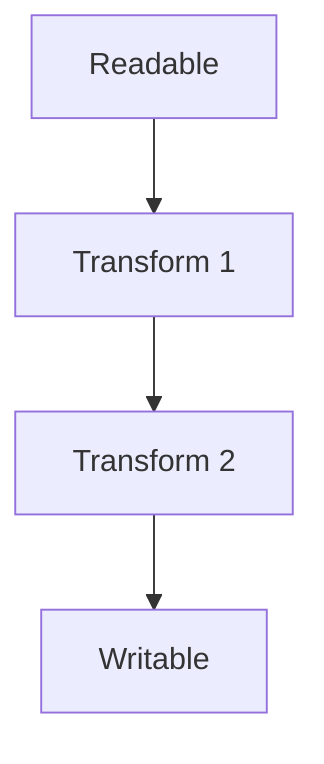
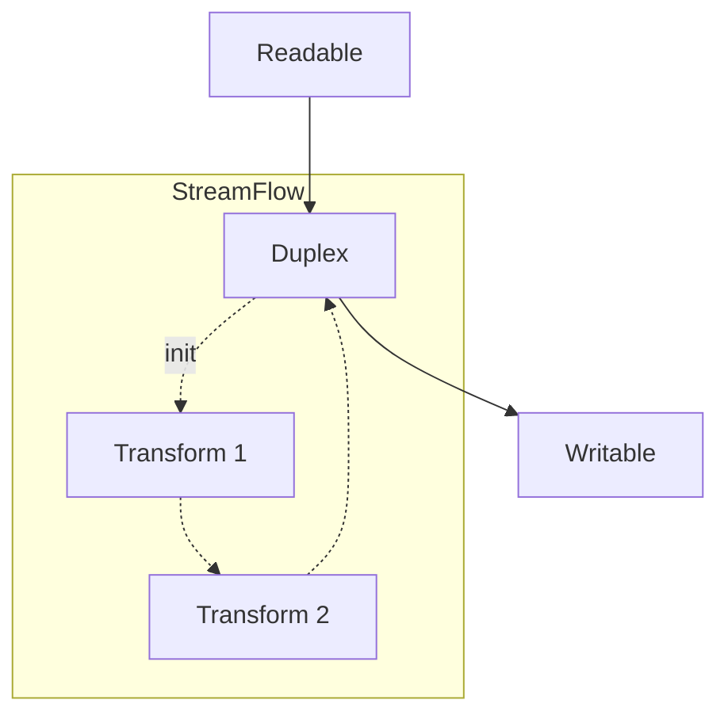

# StreamFlow

Encapsulate stream to use it in OOP.

 [![NPM][npm-image]][npm-url]
 [![Build Status][travis-image]][travis-url]
 [](https://coveralls.io/github/BenoitClaveau/stream-flow?branch=master)
 [![NPM Download][npm-image-download]][npm-url]
 [![Dependencies Status][david-dm-image]][david-dm-url]





```server.js
const StreamFlow = require("stream-flow");
const { Transform, pipeline } = require("stream");
const JSONStream = require("JSONStream");
const fs = require("fs");

fs.createReadStream(`data.json`)
    .pipe(JSONStream.parse("*"))
    .pipe(new Transform({
        objectMode: true,
        transform(chunk, enc, cb) {
            cb(null, chunk);
        }
    }));

/** 
* With stream-flow
* StreamFlow is a duplex stream
*/
class CustomStream extends StreamFlow { {
    constructor({
        objectMode: true,
        init(stream) {          // init must return a stream
            return pipeline(    // create your own flow
                stream,         // input stream
                JSONStream.parse(),
                new Transform({
                    objectMode: true,
                    transform(chunk, enc, cb) {
                        cb(null, chunk);
                    }
                }),
                error => error && this.emit("error", error)
            )
        }
    })
}

fs.createReadStream(`data.json`)
    .pipe(new CustomStream());
```

## Test

To run our tests, clone the stream-flow repo and install the dependencies.

```bash
$ git clone https://github.com/BenoitClaveau/stream-flow --depth 1
$ cd stream-flow
$ npm install
$ cd tests
$ node.exe "../node_modules/mocha/bin/mocha" .
```

[npm-image]: https://img.shields.io/npm/v/stream-flow.svg
[npm-image-download]: https://img.shields.io/npm/dm/stream-flow.svg
[npm-url]: https://npmjs.org/package/stream-flow
[travis-image]: https://travis-ci.org/BenoitClaveau/stream-flow.svg?branch=master
[travis-url]: https://travis-ci.org/BenoitClaveau/stream-flow
[coveralls-image]: https://coveralls.io/repos/BenoitClaveau/stream-flow/badge.svg?branch=master&service=github
[coveralls-url]: https://coveralls.io/github/BenoitClaveau/stream-flow?branch=master
[david-dm-image]: https://david-dm.org/BenoitClaveau/stream-flow/status.svg
[david-dm-url]: https://david-dm.org/BenoitClaveau/stream-flow
